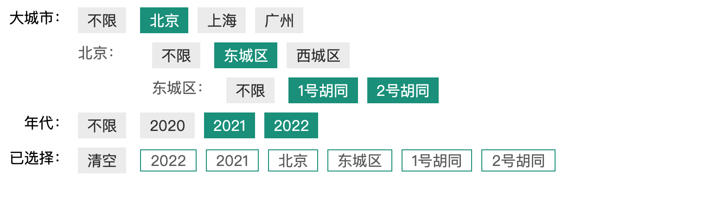

# vue-condition-filter

> condition filter base vue



## Build Setup

支持：

1. 全局定义配置
2. 局部覆盖配置
3. 显示已选中的选项
4. 筛选项无限递归
5. 提供结果获取方法
6. 支持默认选中

实现原理：

1. 对象的引用传递
2. 数据的递归处理和模板递归调用

配置示例

```js
const Configs = [
  {
    value: "city",
    label: "城市",
    type: "single", // 设为单选
    options: [
      {
        value: "北京",
        label: "北京",
        type: "single", // 设为单选
        alias: "region",
        options: [
          {
            value: "东城区",
            label: "东城区",
            alias: "street",
            options: [
              {
                value: "1号胡同",
                label: "1号胡同"
              },
              {
                value: "2号胡同",
                label: "2号胡同"
              }
            ]
          },
          {
            value: "西城区",
            label: "西城区"
          }
        ]
      },
      {
        value: "上海",
        label: "上海",
        alias: "region",
        options: [
          {
            value: "黄浦区",
            label: "黄浦区"
          },
          {
            value: "徐汇区",
            label: "徐汇区"
          },
          {
            value: "静安区",
            label: "静安区"
          }
        ]
      },
      {
        value: "深圳",
        label: "深圳",
        alias: "region"
      },
      {
        value: "广州",
        label: "广州",
        alias: "region"
      }
    ]
  },
  {
    value: "year",
    label: "年代",
    options: [
      {
        value: "2019",
        label: "2019",
        hide: true // 隐藏选项
      },
      {
        value: "2020",
        label: "2020"
      },
      {
        value: "2021",
        label: "2021"
      },
      {
        value: "2022",
        label: "2022"
      }
    ]
  },
  {
    value: "type",
    label: "类型",
    hide: true, // 隐藏选项
    options: [
      {
        value: "type-1",
        label: "type-2"
      }
    ]
  }
];

export default Configs;
```

使用示例

```html
<template>
  <div>
    <ConditionGroup :configs="configs" @change="handleChange" />
  </div>
</template>

<script>
  import Configs from "./config.js";
  import { ConditionGroup, ConditionUtil } from "./condition/index.js";

  export default {
    name: "",

    props: [],

    components: { ConditionGroup },

    data() {
      return {
        configs: [],

        settings: [
          {
            value: "city",
            label: "大城市",
            alias: "city-1", // 直接子类别名
            options: [
              {
                value: "深圳",
                hide: true
              },
              {
                value: "上海",
                active: true
              }
            ]
          }
        ]
      };
    },

    computed: {},

    methods: {
      async getData() {},

      getConditions() {
        return ConditionUtil.getConditions(this.configs);
      },

      handleChange(item, configs) {
        // console.log(item, configs);
        console.log(this.getConditions());
      }
    },

    created() {
      this.configs = ConditionUtil.getConfigs(Configs, this.settings);
      console.log(this.getConditions());
    }
  };
</script>

<style scoped></style>
```

CND 方式使用

```html
<html lang="zh-CN">
  <head>
    <meta charset="UTF-8" />
    <meta name="viewport" content="width=device-width, initial-scale=1.0" />

    <!-- 开发环境版本，包含了有帮助的命令行警告 -->
    <script src="https://cdn.jsdelivr.net/npm/vue"></script>

    <!-- 生产环境版本，优化了尺寸和速度 -->
    <!-- <script src="https://cdn.jsdelivr.net/npm/vue"></script> -->

    <!-- 引入样式 -->
    <link
      rel="stylesheet"
      href="https://cdn.jsdelivr.net/npm/element-ui/lib/theme-chalk/index.css"
    />
    <!-- 引入组件库 -->
    <script src="https://cdn.jsdelivr.net/npm/element-ui/"></script>

    <script src="https://cdn.jsdelivr.net/npm/js-cookie"></script>
    <script src="https://cdn.jsdelivr.net/npm/axios"></script>
    <script src="https://cdn.jsdelivr.net/npm/moment"></script>
    <script src="https://cdn.jsdelivr.net/npm/vue-condition-filter"></script>

    <title>Vue Template</title>

    <style>
      #app {
        width: 600px;
        margin: 0 auto;
        text-align: center;
      }
    </style>
  </head>
  <body>
    <div id="app">
      <condition-group :configs="configs" @change="handleChange" />
    </div>

    <script>
      const DATE_FORMAT = "YYYY-MM-DD HH:mm:ss";

      // Vue.component(ConditionGroup.name, ConditionGroup)

      new Vue({
        el: "#app",

        data() {
          return {
            configs: [
              {
                value: "year",
                label: "年代",
                options: [
                  {
                    value: "2019",
                    label: "2019",
                    hide: true // 隐藏选项
                  },
                  {
                    value: "2020",
                    label: "2020"
                  },
                  {
                    value: "2021",
                    label: "2021"
                  },
                  {
                    value: "2022",
                    label: "2022"
                  }
                ]
              }
            ]
          };
        },

        created() {},

        methods: {
          handleChange(item, configs) {
            // console.log(item, configs);
            // console.log(item, configs);
            console.log(ConditionUtil.getConditions(configs));
          }
        }
      });
    </script>
  </body>
</html>
```

配置参数 `configs`

```js
{
    value: "city",   // 值
    label: "城市",   // 显示
    type: "single", // 设为单选  可选：multiple多选默认，single单选
    alias: "region",  // 值别名，获取结果时有效,如果没有取 value
    options: [
    //   必选配置
      {
        value: "北京",
        label: "北京",
      },
    //   可选配置
      {
        value: "上海",
        label: "上海",
        active: true, // 默认选中
        hide: true,   // 隐藏该选项
        hideOptions: true, // 影藏子选项
      }
      ]
}
```

事件：
```
@change(option, configs)  用户点击选项时触发
```